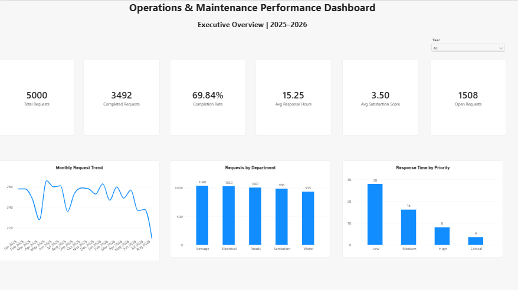
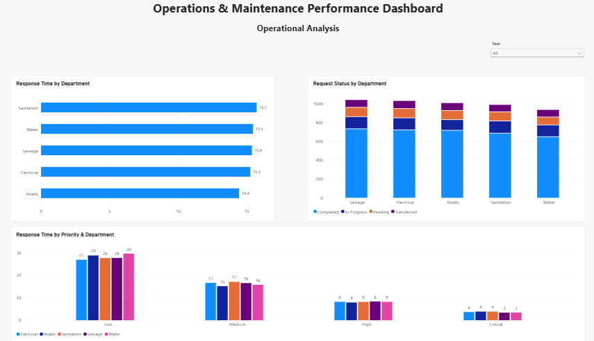
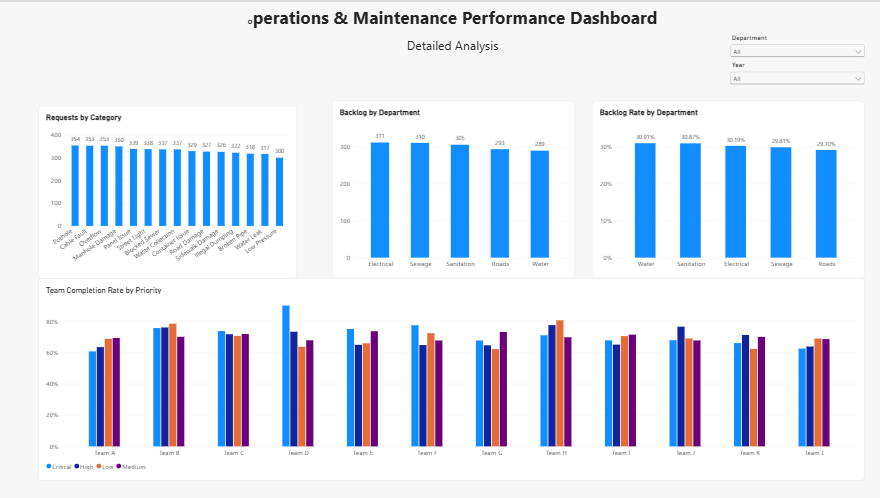

# Operations & Maintenance Performance Dashboard

## Overview

This project presents an end-to-end Power BI analysis of **5,000 simulated operations and maintenance requests** covering the period from 2025 to 2026.

The dashboard was developed to analyze operational performance, response times, completion rates, backlog, team performance, and service request patterns to support data-driven decision-making.

The project covers the complete analytics workflow:

**Raw Data → Data Cleaning → Data Modeling → DAX → Data Visualization → Business Insights**

> **Note:** The dataset used in this project is simulated and contains no sensitive or confidential organizational data.

---

## Business Questions

This dashboard was designed to answer the following business questions:

- How many maintenance requests were received and completed?
- What is the overall completion rate and current backlog?
- How does response time vary by request priority?
- Are there significant differences in response time across departments?
- How are requests distributed across departments and service categories?
- How do completion rates vary across assigned teams and priority levels?
- Which departments have the highest backlog counts and backlog rates?
- Are operational performance differences primarily associated with departments, teams, or request priorities?

---

## Dataset

The project uses a simulated dataset containing **5,000 operations and maintenance requests** covering the period from **2025 to 2026**.

The dataset includes:

- Request ID and request date
- Department and service category
- Request priority
- Service area
- Assigned team
- Request status
- Response time in hours
- Completion date
- Customer satisfaction score

---

## Data Cleaning & Preparation

Data preparation was performed using **Power Query** in Power BI.

Key data preparation steps included:

- Profiled all 5,000 records to evaluate data quality and column distributions.
- Corrected date and time data types.
- Created a date-only version of the request date for relationship modeling.
- Validated missing values in `ResponseHours` and retained them rather than replacing them with zero.
- Validated null values in `CompletionDate` against request status.
- Confirmed that null completion dates represented open or non-completed requests rather than data errors.
- Reviewed response-time outliers and retained valid extreme values.
- Verified satisfaction scores and categorical fields for consistency.

> **Data Quality Decision:** Missing values were not automatically removed or replaced. Their business meaning was investigated first to avoid introducing misleading assumptions into the analysis.

---

## Data Model

A dedicated `DateTable` was created to support time-based analysis and provide a structured calendar dimension.

The model uses a **one-to-many relationship**:

`DateTable[Date]` → `Maintenance_Requests[RequestDateOnly]`

The Date table includes:

- Year
- Month
- Month Number
- Quarter
- Month-Year
- Year-Month sorting key

`MonthYear` was sorted using the numerical `YearMonthSort` column to maintain the correct chronological order in dashboard visuals.

---

## DAX Measures

Several DAX measures were created to calculate the main operational KPIs.

```DAX
Total Requests =
DISTINCTCOUNT(Maintenance_Requests[RequestID])

Completed Requests =
CALCULATE(
    [Total Requests],
    Maintenance_Requests[Status] = "Completed"
)

Completion Rate =
DIVIDE(
    [Completed Requests],
    [Total Requests],
    0
)

Avg Response Hours =
AVERAGE(Maintenance_Requests[ResponseHours])

Avg Satisfaction Score =
AVERAGE(Maintenance_Requests[SatisfactionScore])

Open Requests =
[Total Requests] - [Completed Requests]

Open Rate =
DIVIDE(
    [Open Requests],
    [Total Requests],
    0
)
```

---

## Dashboard Pages

The Power BI dashboard consists of three analytical pages, each designed for a different level of analysis.

### 1. Executive Overview

Provides a high-level view of operational performance through key KPIs and management-focused visuals.

**Key metrics:**

- Total Requests: **5,000**
- Completed Requests: **3,492**
- Completion Rate: **69.84%**
- Average Response Time: **15.25 hours**
- Average Satisfaction Score: **3.50 / 5**
- Open Requests: **1,508**

The page also includes monthly request trends, department workload, response time by priority, and year filtering.

### 2. Operational Analysis

Provides deeper analysis of operational performance across departments and request priorities.

The page focuses on:

- Response Time by Department
- Request Status by Department
- Response Time by Priority and Department

This view helps distinguish department-level differences from differences associated with request priority.

### 3. Detailed Analysis

Provides more granular analysis of workload, backlog, and team performance.

The page includes:

- Requests by Category
- Backlog by Department
- Backlog Rate by Department
- Team Completion Rate by Priority
- Department and Year filtering

---

## Dashboard Screenshots

### Executive Overview



### Operational Analysis



### Detailed Analysis



---

## Key Insights

- **Overall Performance:** Of 5,000 maintenance requests, 3,492 were completed, resulting in an overall completion rate of **69.84%**, while **1,508 requests** remained open.

- **Priority and Response Time:** Average response time decreases substantially as request priority increases. Low-priority requests take approximately **28 hours**, Medium **16 hours**, High **8 hours**, and Critical requests around **4 hours**.

- **Department Response Times:** Average response time ranges from approximately **14.4 to 15.7 hours** across departments, indicating relatively small overall differences between departments.

- **Priority-Level Analysis:** When departments are compared within the same priority level, response times remain relatively similar. This indicates that priority is more strongly associated with response-time variation than department alone.

- **Department Workload:** Request volume is relatively balanced across departments. Sewage recorded **1,040 requests**, followed by Electrical **1,030**, Roads **1,007**, Sanitation **988**, and Water **935**.

- **Team Performance:** Completion rates vary across assigned teams and priority levels. These differences identify areas for further investigation rather than automatically indicating poor team performance.

- **Backlog Count vs. Rate:** Electrical has the highest number of open requests (**311**), while Water has fewer open requests (**289**) but an open rate of approximately **31%**. This demonstrates the importance of evaluating both absolute counts and rates.

- **Backlog Pattern:** Open rates vary across departments and priorities, but no consistent priority-driven backlog pattern is observed across all departments.

- **Partial-Period Validation:** The apparent decline in request volume in August 2026 should not automatically be interpreted as an operational decline because the period may contain incomplete monthly data and should be validated first.

---

## Tools & Technologies

- **Microsoft Excel** — Source data preparation
- **Power BI** — Data modeling, analysis, and visualization
- **Power Query** — Data cleaning and transformation
- **DAX** — KPI and analytical measure development
- **GitHub** — Project documentation and portfolio publishing

---

## Project Skills Demonstrated

**Data Cleaning | Data Validation | Power Query | Data Modeling | DAX | KPI Development | Data Visualization | Operational Analysis | Business Insights | Power BI**

---

## Author

**Abdulkarim Hassouna**

Data Analyst | Power BI | Excel | Data Visualization | IT & Network Engineering
